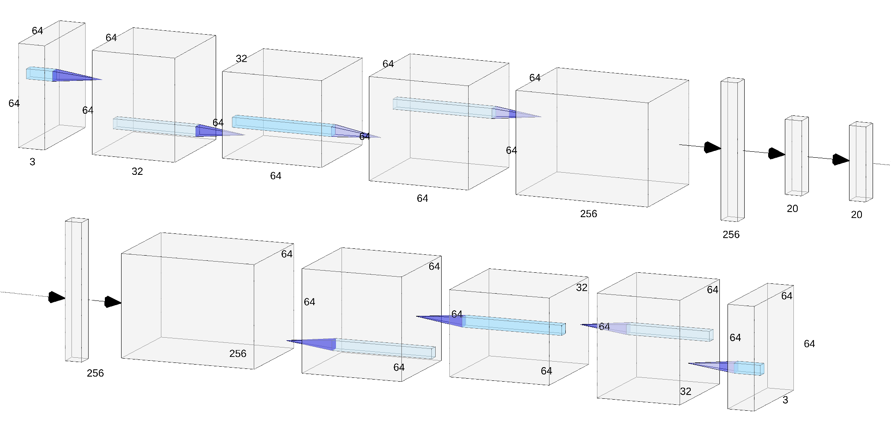
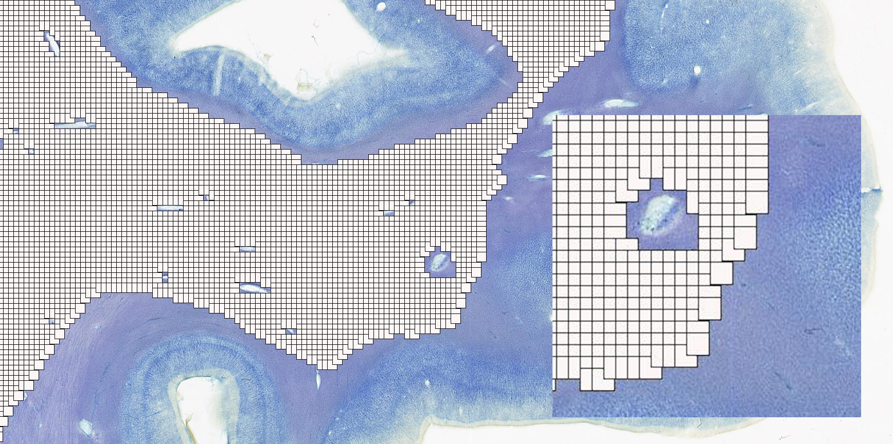

# VAE
This code is a portion of my master thesis: 
# Variational Autoencoders for Histological Image Segmentation of the Cerebral Subcortex
Bioinformatics & Systems Biology Major Internship 2020
University of Amsterdam

the structure should work for 64x64 images by updating the root folder of the dataloader.

IMCN Research Unit Integrative Model-based Cognitive Neuroscience

Using the determinitic warmups and L1 loss, BetaL1.py illustrates the architecture of the VAE model:

The model is trained by minimizing a loss that balances reconstruction accuracy (how well the output matches the input) and KL divergence (ensuring the latent space resembles a standard normal distribution), enabling both data reconstruction and generation of new samples.

If you have questions about VAEs or wish to learn about our implementation, feel free to contact me!

🥷🏼👾 douzog(@)proton.me

